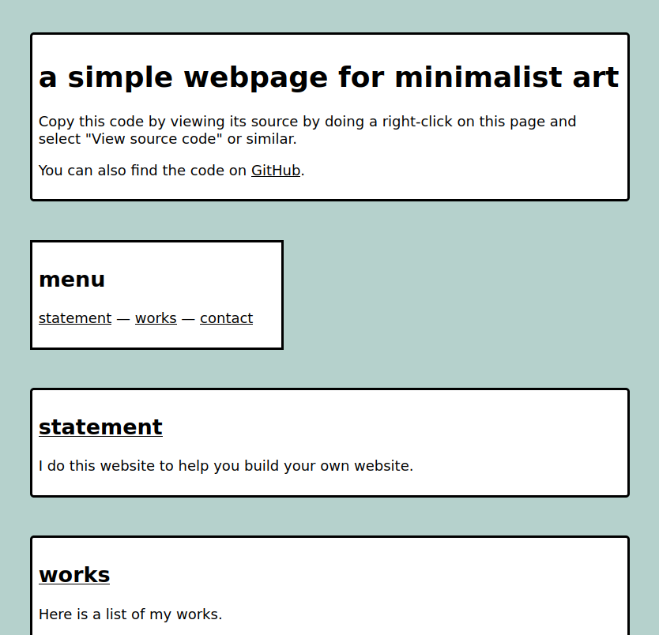

# htmlfreewrites

the goal: to create a few relatively simple HTML/CSS only websites for other people to use.

## first example: minimalist art website

available at [https://eviau.net/htmlfreewrites/minimalistart/minimalistart.html](https://eviau.net/htmlfreewrites/minimalistart/minimalistart.html) and the code is in the `minimalistart` folder of this repo. See the [README](https://github.com/eviau/htmlfreewrites/blob/main/minimalistart/README.md) for more info on how to adapt the project to your needs.
