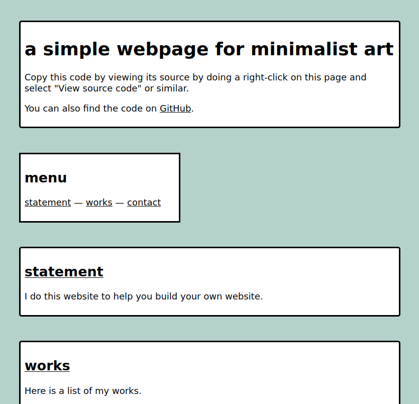

# a minimalist art website

*jan 2022*

a few notes on how to make this website yours :sparkles:



## references

* [the github repo with all the code and images](https://github.com/eviau/htmlfreewrites/tree/main/minimalistart)
* [the website proper](https://eviau.net/htmlfreewrites/minimalistart/minimalistart.html)

If you need a refresher on HTML fundamentals, see the excellent [MDN docs tutorial on HTML](https://developer.mozilla.org/en-US/docs/Learn/Getting_started_with_the_web/HTML_basics).

## why make a tiny minimalist website

I have been revisiting HTML/CSS websites (i.e. no JavaScript, no dynamic back-end, only static pages) for some time now.

One thing that struck me was how much different developing for the web had become over the years. I feel that it used to be much more easier to learn by example a few years ago...? Maybe I just don't know where all the people building handmade HTML websites were hanging out! But then a friend told me about [html.energy] and I decided to work on a tiny arts website during the first freewrite event. Hence this current repo you are reading.

So why make such a website in 2022? I see a few good reasons:

* to learn fundamental web technologies from scratch
* to build websites that don't need a framework/database to exist
* to build on ideas for a [web frugal](http://site.sarahgarcin.com/web-frugal/)
* because you don't need something complex to maintain to have something meaningful
* to showcase your own work on a domain you own instead of a major platform
* ... and probably many others.

The idea behind this project is that a lot of the tech we used is not that complex - we can understand it! and build on top of it!

I think it's possible to make interesting, tiny websites with only a little HTML/CSS - and so can you!

Now, let's take a look at how you could use this current template to make a website that feels like home for you :sparkles:

The **knob** tag will be used every time a possible change is mentionned.

## let's get started !

To tweak this website to your needs, you will need:

* a text editor

Anything that allows you to write text with formatting - personnally, I use the text editor that comes with Ubuntu, `gedit`. There are free equivalents on any OS.

* a web browser

You don't need to be hosting your file on a server to see them - you can see local files from your web browser. They won't be accessible to the Internet, so you cannot share them with a URL.

* some time

An hour or two, maybe an afternoon or a day if you have a lot of content). Maybe less, maybe more - it depends on where you are on your learning journey :) As a datapoint, I made the website in about two hours, took a break and came back to it for maybe 30 min to fix the most apparent issues. 

The website contains two main files: the `minimalistart.html` and its associated `style.css`. There are also placeholder images - files ending in `.png`. We won't cover the creation of these as we expect that you have your own work you want to show.

## the HTML side

On `minimalistart.html`, we have the content and some tags to structure it. Let's go through some of its features together as a way to learn what everything is doing :) 

I often start writing a webpage from [a draft for a basic HTML page, like this one on MDN docs](https://developer.mozilla.org/en-US/docs/Learn/HTML/Introduction_to_HTML/Getting_started#anatomy_of_an_html_document). It looks like this:

```
<!DOCTYPE html>
<html>
  <head>
    <meta charset="utf-8">
    <title>My test page</title>
  </head>
  <body>
    <p>This is my page</p>
  </body>
</html>

```

Then, I add `lang="en"` or `lang="fr"` to the `<html>` tag to specify the language. You can **knob** this to the language you wish; see [the MDN docs for more info](https://developer.mozilla.org/en-US/docs/Web/HTML/Global_attributes/lang).

### `<head>` tag

Next step: editing the `<head>` section.

To make it possible to use `viewport` values in the CSS file when browsing on mobile, I add the following line:

```
<meta name="viewport" content="width=device-width, initial-scale=1">
```

More information on [viewport values on the MDN docs website](https://developer.mozilla.org/en-US/docs/Web/HTML/Viewport_meta_tag).

We also tell where the CSS file `style.css` can be found and add it to the website with:

```
<link rel="stylesheet" href="style.css">
```

And finally, we have a **knob**: we change the content of the `<title>` tag for the one we wish for our website. In this case, it is "a simple webpage for minimalist art", but you can definitely change this to match your desires.

That's it for the `<head>` tag!

### `<body>` tag

The `<body>` tag contains four types of tags, namely the `<header>`, the `<nav>`, the `<div class="content">` and the `<footer>`.

#### `<header>` tag

In the header, we briefly describe what the website. Find [more information on the `<header>` tag on MDN docs](https://developer.mozilla.org/en-US/docs/Web/HTML/Element/header)

Let's start with the level-1 heading, the `<h1>` tag. Headings help make your website accessible if you use them correctly. You can find [info about accessibility and headings on w3.org](https://www.w3.org/WAI/tutorials/page-structure/headings/). So, what is the main heading of your website? Here we have a **knob**: change the content of this tag.

The next tags are two paragraphs, denoted by the `<p>` tags. **Knob**: Say a thing or two about your website. You can add more paragraphs if you wish; you can add links by using the `<a>` tag. You can also decide that there will be no paragraphs at all!

And this closes the `<header>` tag content.

#### `<nav>`

This menu is all about providing [navigation links - MDN docs](https://developer.mozilla.org/en-US/docs/Web/HTML/Element/nav).

We add a level 2 header with `<h2>` that mentions that this is the menu, and then we add links to the other `<h2>` on the page.

Here is an **(optional) knob**: maybe you want one more or one less section - maybe you want to rename them? Change the content of the `<a>` tags to reflect this. Note that each navigation link is separated by a `&mdash` string - this will be rendered as `&`.

Note that the `href` specified in the links are related to the heading with the specified `id`! The `<a href="#section-title">Section title</a>` tag will be a link to the `<h2 id="section-title">Section title</h2>` heading. See the [section on document fragment](https://developer.mozilla.org/en-US/docs/Learn/HTML/Introduction_to_HTML/Creating_hyperlinks#document_fragments) on MDN docs.

#### `<div class="content">`

What's the difference between `id` and `class`? In short, an `id` is meant to be used only once; a `class` can be attributed to more than one element.

Here, we use `class` instead of `id` because we will be making a few `<div>`s with the same styling. 

Each `<div>` starts with a `<h2>` heading that also has an `id` corresponding to one of the navigation link created in the previous section.

The next **knob** is to make sure that all the navigation links point to a section. For each `<a href="#a-section">` link that you have in the navigation menu, make sure there is a corresponding `<div>`. It should at least be the following:

```
<div class="content">
    <h2 id="#a-section"><a href="#a-section">A Section</a></h2>
</div>
```

On the original minimalist art website, there are three such sections: `#statement`, `#works` and `#contact`. Let's look at them.

* `#statement`

The **knob** here is to write down your artist's statement. It can be tiny or more in depth; add `<p>` tags as you see fit.

* `#works`

This section is about showcasing your work. Each work is structured with a heading, a description, and a picture.

There are a few **knobs** on this section to allow you to show your work and not the placeholder images and description.

First, add an image of you work to the same folder as the one that contains the HTML webpage. Then, update the `` tag with the name of this file. Let's say the name of your image is `image.jpg`. Then, the following tag:

```

```

become this tag:

```

```

Second, change the alternative text description to a description of the work you are showing an image of. This is the content of the `alt` attribute in the `` tag. Find [more information on alternative text on MDN docs](https://developer.mozilla.org/en-US/docs/Web/API/HTMLImageElement/alt).

Third, add a description of the work in the `<p>` tag, mentionning the medium, where it has been shown or will be shown, or any other meaningful information about it.

Finally, update the `<h3>` heading to reflect the work you are showcasing; it could be the title of the work, including the year of creation.

Another **knob** here is to add as many of these `<h3>` tags with the accompanying `` as you want!

Now, let's tell people how to contact you.

* `#contact`

The last `<div class="content">` contains your contact information.

**Knob**: Let people know how to get in touch with you by adding your own email instead of the placeholder one: change the `email@example.com` address to the one you want to use.

We are done adapting the content of the website! Good job!

#### `<footer>` 

Any other closing information you want to add can go here. I added the license to this section. A possible **knob** could be to add the place you are writing from, the current year or the date of the last time the site was updated.

This closes the HTML page - let's go the CSS side!

## adding some styling with a CSS file

We are now ready to change the style of the website, adding colours and picking a font.

### body

The two main **knobs** here are the following attributes:

* `font-family`: if you want a tiny website, pick a font from the ones that are usually available on all web browsers - here is a [list of fonts](https://developer.mozilla.org/en-US/docs/Web/CSS/font-family#values)
* `background-colour`: this is maybe the one change you really want to make to customize this website! You might want to read about [HTML colors codes and names](https://developer.mozilla.org/en-US/docs/Web/CSS/color_value)

You can also try changing the other attributes! Learn more about them on the MDN docs website if you need a refresher.

### a

The `color` attribute will change the color of any `<a>` tag item on the HTML page. This is a **knob**, as long as you make sure that the contrast with the background color doesn't make your links difficult to see. More info on [accessibility and constrat](https://developer.mozilla.org/en-US/docs/Web/Accessibility/Understanding_WCAG/Perceivable/Color_contrast).

### header, footer, nav and .content

The main **knobs** are :

* `border` : this changes the style of the border element of the header. Read the [MDN docs for border options](https://developer.mozilla.org/en-US/docs/Web/CSS/border).
* `border-radius` with a positive value makes for rounded corner.
* `background-color` allows you to change the color of the header background.

Read on the MDN docs website to learn more about the other attributes.

### img

There are no knobs here, only a note: it is the `max-width: 100%` and `height: auto` combination that allows the `` content to scale accordingly to the size of the container. Read more about this on [this MDN docs page about preserving aspect-ratio of images](https://developer.mozilla.org/en-US/docs/Web/Media/images/aspect_ratio_mapping).

We are done adapting the style of the website! Wonderful :)

## questions ?

I hope that you learn a thing or two about making your own tiny HTML/CSS website!

Feel welcome to leave a comment in the [issues of the htmlfreewrites GitHub repo](https://github.com/eviau/htmlfreewrites/issues)


